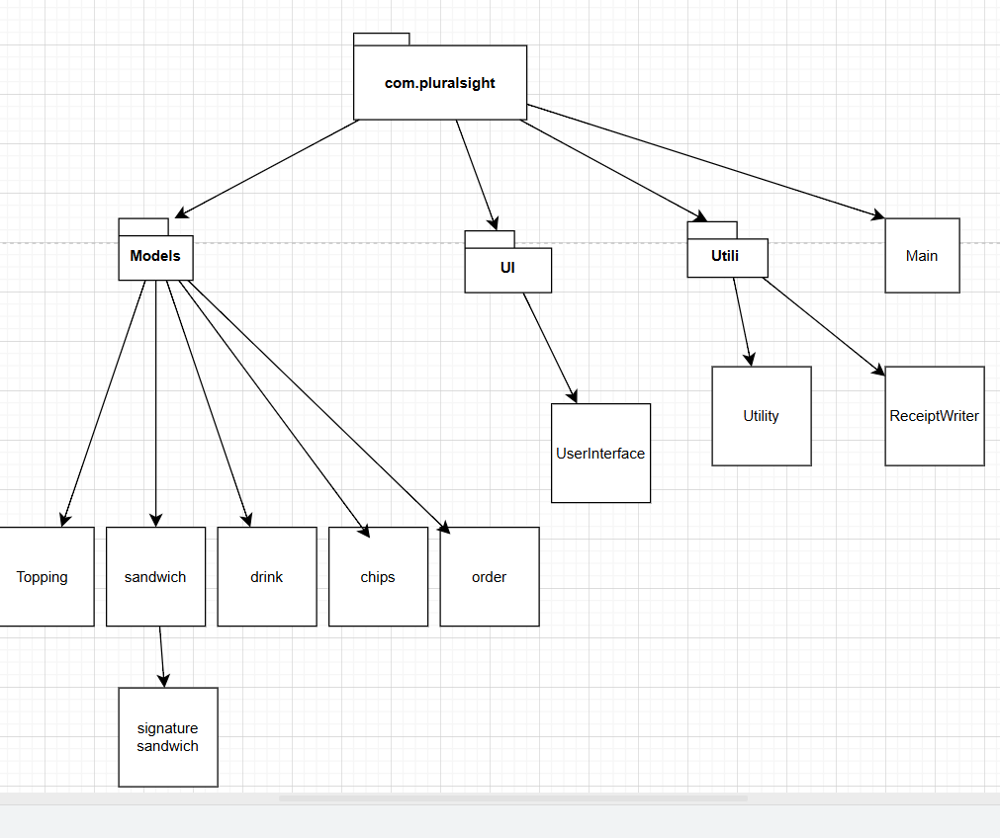
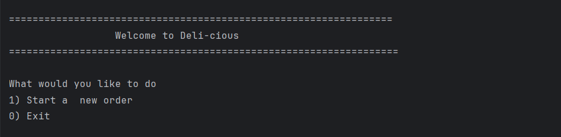
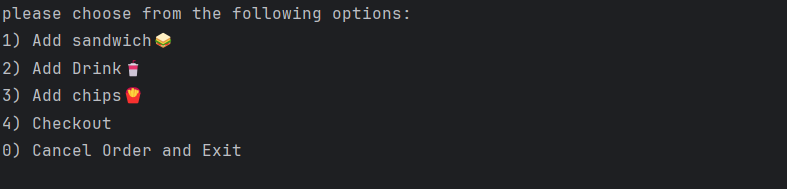

# DELI-cious Sandwich Ordering App

*DELI-cious* is a simple console-based Java application that allows users to build their own sandwiches or choose from a selection of signature sandwiches. Users can also add drinks, chips, and sides to their order. When they're done, the app generates a receipt with their complete order summary and total price.

---

## Features

✅ Build your own sandwich  
✅ Choose from preset signature sandwiches (like Philly Cheese Steak or BLT)  
✅ Customize signature sandwiches (add/remove toppings)  
✅ Add drinks, chips, and sides  
✅ Calculate total price  
✅ Save a receipt file with the order summary  
✅ Validates user input for better user experience

---

## Project Structure

- **/models**: Contains data models like Sandwich, SignatureSandwich, Topping, Drink, Chips, and Order.
- **/ui**: Contains the UserInterface class that handles all user interactions.
- **/util**: Contains helper classes like ReceiptWriter for saving receipts and Utility for general helper methods.
- **/resources**: Stores receipt files in the /resources/receipts folder.

---
## Architecture Diagram
Here's an overview of the project's architecture and relationships:

## Home screen

## Order screen

## How to Run

1. Clone the repository to your local machine.
2. Open the project in your Java IDE (like IntelliJ IDEA or Eclipse).
3. Build the project to compile all classes.
4. Run the **UserInterface** class to start the application.

---

## Technologies

- *Java 17 (or above)*
- *No external dependencies* – uses only standard Java libraries.

---

## Notes

- The application uses simple console input/output, so it should work on most console environments.
- In some terminals, the "clear screen" method may not fully clear the console, depending on your environment.
- The receipts are saved in the /resources/receipts directory with the date and time as the filename.

---

## Future Improvements

✨ Add more signature sandwiches

✨ User authentication for saved orders

✨ Option for delivery or pickup

---

## License

This project is open-source and free to use for educational purposes!

---

*Happy ordering! 🥪*